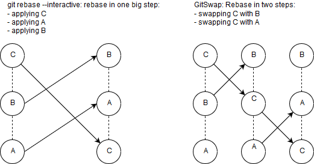
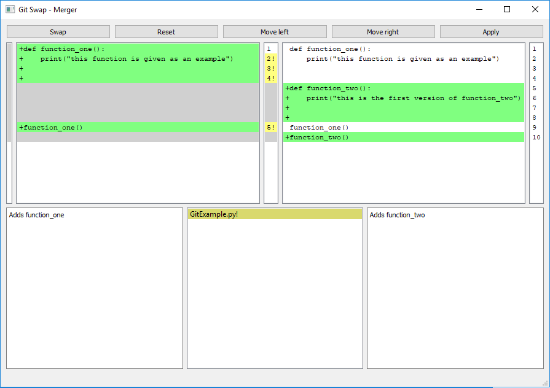
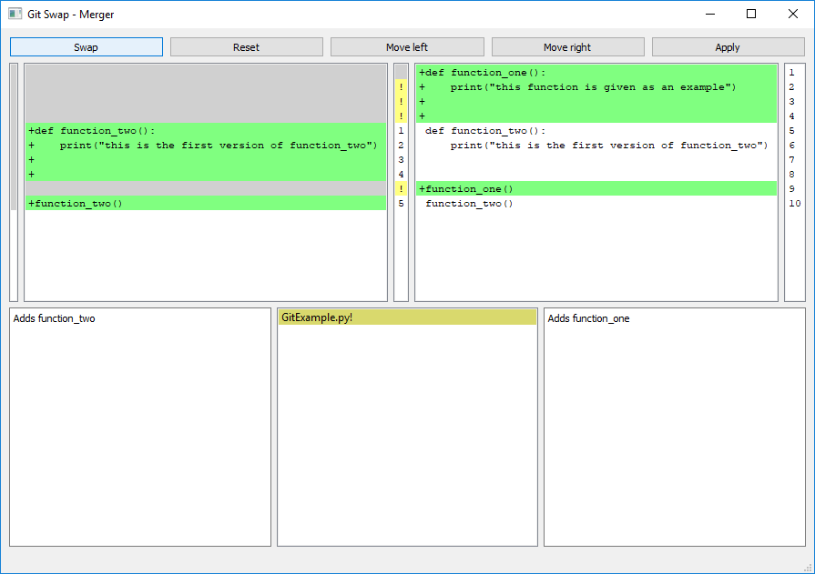
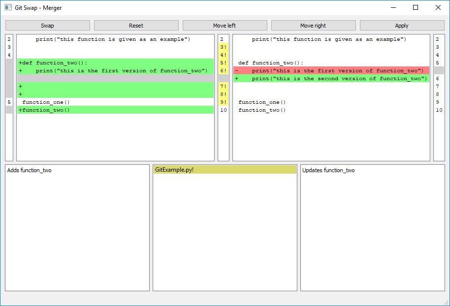
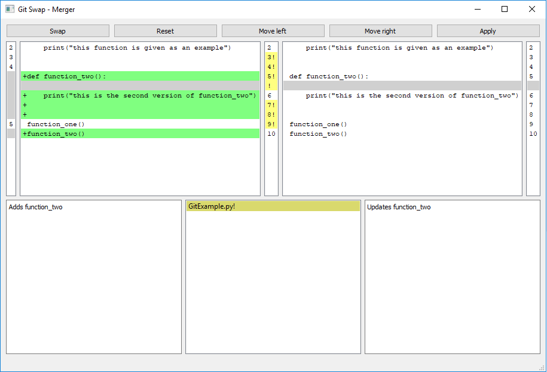

[Home](../readme.md)

Reordering commits: how is this tool different ?
------------------------------------------------
"git rebase --interactive" lets you apply patches in an arbitrary order. 

This method is subject to two root problems: 
- The diffs of your commits are described as addition and deletion at given lines, with some context (3 unmodified lines before and after).  
When changing the order of the commits, these line numbers may become incorrect. This makes it hard to ensure merge tools suggest placing additions/deletions at the right place.
- Should you have a commit (A) that adds a line, and a second commit (B) which removes that line, if you reorder (B) before (A):
   - A conflict will appear while applying the removing commit (B): nothing has to be removed, so nothing happens
   - The commit (A) which add the line is applied, and no conflict is detected  
 
  This simple use case may happen without you noticing while you clean your history.

These problems can be solved by always swapping adjacent commits:
- We can keep line numbers up to date.
- We can detect lines that are added and deleted in the next commit, and deal with them correctly.

*git rebase --interactive* vs *swapping adjacent commits* 

Swapping commits is tedious with existing git tooling: GitSwap lets you do that easily (plus some QoL features).

**Example: Keeping line numbers up to date:**

We want to swap function_one and function_two:    

Line numbers before the first commit are displayed left (empty, since we create a new file).  
Line numbers between the two commits are displayed in the middle.  
Line numbers after applying the second commit are displayed on the right.  

**Result after pressing "Swap":**

Note how line numbers are kept up to date.

**Example: Detecting conflicts and solving them:**

In this example, we want to swap two commits, however a conflict is detected.

We do not want the line 6 to end up adding *print(...)* after our rebase.  
In this case we probably want to merge these two commits, so we press "Move left" to move all this file content to the first commit.

**Result after pressing "Move left":**  

note how the first version of *print(...)* is deleted
