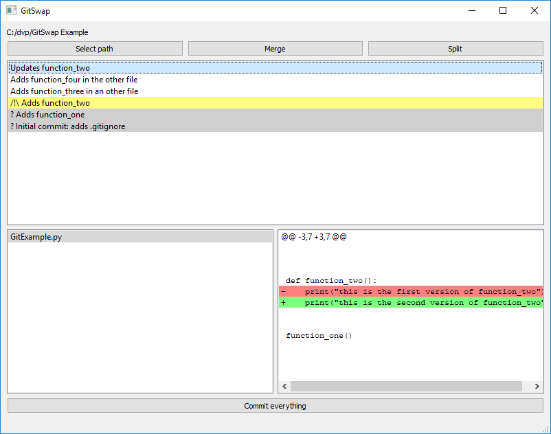

Git Swap: an alternative tool for interactive rebases
=====================================================

GitSwap : "git rebase --interactive" with a GUI and without weird conflicts.

Reordering and renaming commits of a feature branch, as well as reorganizing commit contents 
(squashing, etc.) is often necessary to ensure a git history remains easy to navigate and understand.
This enables easier : 
- merge request reviews.
- history analysis (to know which commit introduced a specific line of code and why).
- rebases of entire feature branches from one project to the other (if your workflow requires it). 

This tool aims to streamline uses of "git rebase --interactive": it helps you keep your history clean.
- Split, merge and reword your commits
- While reordering commits, detect and solve conflicts as early as possible (before Git algorithms get lost). See [Reordering commits](Doc/reordering.md) for more details about the theory behind GitSwap.

**Disclaimer**: This tool is in an early stage of development.  
All the core functionalities are present, and you will be able to roll back any modifications.  
However, you may experience slowdowns, occasional crashes and incompatibilities with your environment.  
I encourage to try it and to see if it works in your setup and suits your needs.

Who could be interested ?
-------------------------
Any developer using the "git rebase --interactive" command from time to time, in order to share a "clean" history (before a Merge Request for instance).

How to use
----------
Get Git, Python 3 with PyQt5, and run GitSwap.py. 

More options coming soon.

---

[User manual](Doc/user_manual.md)

[Developer's notes, Planned features and Known bugs](Doc/technical_notes.md)